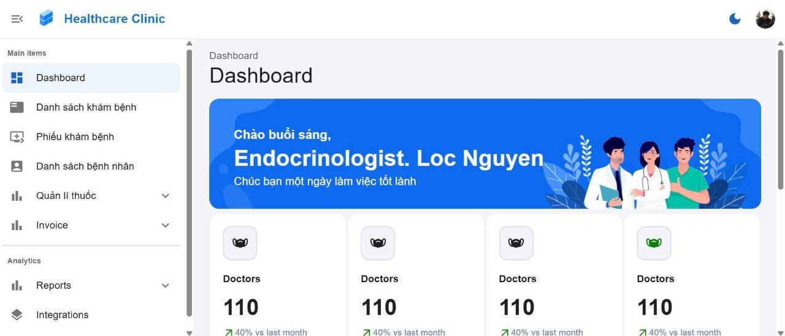

# FINAL PROJECT OF INTRODUCTION TO SOFTWARE ENGINEERING COURSE-SE104.P21
<p align="center" style="background-color: white; padding: 10px;">
  <a href="https://www.uit.edu.vn" target="_blank">
    
  </a>
</p>

## INTRODUCTION TO SOFTWARE ENGINEERING
# Table of Contents
- [Introduction to the course](#introduction-to-the-course)
- [Members](#members)
- [Introduction](#introduction)
- [Business Analysis](#📝-business-analysis)
- [Objectives](#🎯-objectives) 
- [Functional Requirements](#📋-functional-requirements) 
- [Project Structure](#📁-project-structure)
- [Installation & Local Setup](#🚀-installation--local-setup)
- [Contact](#📫-contact)
# Introduction to the course
- Lecturer: PhD. Do Thi Thanh Tuyen.
- Course name: Introduction to software engineering.
- Course code: SE104.
- Class code: SE104.P21.

# Members
| No | ID       | Student's name        | Github                                                       | Email                                                 | Role         |
|-----|----------|------------------------|--------------------------------------------------------------|-------------------------------------------------------|--------------|
| 1   | 22520792 | Nguyen Vo Tien Loc     | [Nguyen Vo Tien Loc](https://github.com/iseT1enLoc)          | [22520792@gm.uit.edu.vn](mailto:22520792@gm.uit.edu.vn) | Leader, Backend developer       |
| 2   | 22520126 | Truong Hoai Bao      | [Truong Hoai Bao](https://github.com/hoaibao2k4)             | [22520126@gm.uit.edu.vn](mailto:22520191@gm.uit.edu.vn) | Frontend Developer  |
| 3   | 22520341 | Pham Van Duy           | [Pham Van Duy](https://github.com/duyp6090)                  | [22520341@gm.uit.edu.vn](mailto:22520341@gm.uit.edu.vn) | Backend developer |
| 4   | 23521235 | Nguyen Thi Ngoc Phuoc     | [Nguyen Thi Ngoc Phuoc](https://github.com/pgnjams)          | [23521235@gm.uit.edu.vn](mailto:23521235@gm.uit.edu.vn) | Frontend developer, UI designer       |

## 📝 Business Analysis

### 📌 Project: **Private Clinical Hospital Management System**
- Aimed at modernizing and streamlining the operations of a private clinic.
- Covers patient registration, appointment scheduling, medical records, billing, and reporting.

### 💻 Tech Stack
- **Backend:** Java Spring Boot  
- **Database:** MySQL  
- **Deployment:** Docker Compose

### 🌐 GitHub Repositories
- **🖥️ Frontend:** [Healthcare-Clinic](https://github.com/hoaibao2k4/Healthcare-Clinic)  
  *Modern and responsive interface for doctors, staff, and patients.*
- **🧪 Research (Vitamin D Prediction):** [G8Vitamin](https://github.com/iseT1enLoc/G8Vitamin)  
  *Machine learning research for predicting Vitamin D deficiency based on health records.*




### 🎯 Objectives
- Centralize and streamline patient, examination, and reporting workflows.
- Enforce Role-Based Access Control (RBAC) for Admin, Doctor, and Staff.
- Automate and simplify the generation of monthly performance and utilization reports.
- Ensure data security, privacy, and compliance with healthcare regulations (e.g., HIPAA).
- Provide a user-friendly interface for managing patient information and healthcare operations.

### 👥 Stakeholders
- **Hospital Administrator:**  
  - Responsible for overseeing the entire system's configuration, user management, and high-level operational metrics.
  - Can view and manage hospital-wide data and generate reports.
  - Manages user permissions and can assign roles to ensure the right level of access for each role (Admin, Doctor, Staff).

- **Doctors:**  
  - Can access and manage the medical records of their assigned patients.
  - Document examinations, diagnose conditions, prescribe treatments, and track patient progress over time.
  - Review historical data to ensure continuity of care for patients.

- **Staff (Nurses / Receptionists):**  
  - Handles patient registration, scheduling appointments, and updating basic patient demographic information.
  - Manages the creation of invoices and payment processing.
  - Ensures patient records are updated and accurate.

- **Patients:**  
  - Not a direct user of the system, but their data is the central point for all hospital workflows.
  - Will benefit from accurate records, timely care, and the ability to schedule and track appointments.

---
## 📋 Functional Requirements

| No. | Requirement Name                     | Notes                                                                 |
|-----|--------------------------------------|-----------------------------------------------------------------------|
| 1   | Create daily medical examination list | Record the list of patients examined each day                        |
| 2   | Create medical examination form      | Enter examination details and prescribe medicine                     |
| 3   | Search patient                       | Filter patients by conditions                                        |
| 4   | Create payment invoice               | Calculate fees and generate invoice                                  |
| 5   | Generate reports                     | Summarize patient data, revenue, and medicine usage statistics       |
| 6   | Manage medicine catalog              | List medicines with unit, price, and usage instructions              |
| 7   | Manage disease types                 | Disease categories linked to examination forms                       |
| 8   | Manage accounts & roles              | Login accounts with roles: ADMIN / DOCTOR / SUPPORTER                |
| 9   | Manage staff                         | Store internal employee information                                  |
| 10  | Change regulations                   | Adjust system rules (parameters)                                     |


## 📁 Project Structure

```bash
hospital-management/
├── src/
│   ├── main/
│   │   ├── java/com/example/demo/
│   │   │   ├── configuration/      # Spring Boot & security configurations
│   │   │   ├── controller/         # REST controllers
│   │   │   ├── domain/             # JPA entities (Patient, ExamRecord, User, Role)
│   │   │   ├── dto/                # Data Transfer Objects
│   │   │   ├── exception/          # Custom exception handlers
│   │   │   ├── repository/         # Spring Data JPA repositories
│   │   │   ├── security/           # JWT filters, user details service
│   │   │   ├── service/            # Business logic services
│   │   │   └── util/               # Utility classes (PDF report generator, mappers)
│   │   │   └── validator/               # handle validate
│   │   └── resources/
│   │   │   ├── application.yml     # Spring Boot & DB properties
│   │   │   └── sql/                # Initial schema & seed data scripts
│   │   └── DemoApplication.java
│   └── test/
│       └── java/com/clinic/        # Unit & integration tests
│
├── docker-compose.yml              # MySQL, Redis (optional), App service definitions
├── Dockerfile                      # Java build & runtime image
├── .env                            # Environment variables for compose
├── .gitignore
├── README.md                       # This file
└── pom.xml                         # Maven project definition
```
## 🚀 Installation & Local Setup

### 1. 📦 Clone the Repository

```bash
git clone https://github.com/duyp6090/private_clinic_management_se104.git

```

```
cd private_clinic_management_se104

```
### 2. Docker set up
```
docker-compose up -d

```

<!-- ### 3. Run the project
## ⚙️ Usage

### Authentication

All endpoints (except `/auth/login` and `/auth/register`) require a valid JWT in the `Authorization: Bearer <token>` header.

### Key Endpoints

| Resource                  | Method | Endpoint                                              | Roles          | Description                                 |
|---------------------------|--------|-------------------------------------------------------|----------------|---------------------------------------------|
| **Users / RBAC**          | GET    | `/api/admin`                                          | Admin          | List all users & roles                     |
|                           | POST   | `/api/admin/register-doctor`                          | Admin          | Create a new doctor                         |
|                           | POST   | `/api/admin/register-supporter`                       | Admin          | Create a new doctor                         |
| **Patients**              | GET    | `/api/patients`                                       | Admin, Staff   | List all patients                           |
|                           | POST   | `/api/patients`                                       | Staff          | Create a new patient record                 |
|                           | PUT    | `/api/patients/{patientId}`                           | Staff          | Update patient details                      |
| **Examinations**          | GET    | `/api/patients/{patientId}/exams`                     | Admin, Doctor  | List exam records for a patient             |
|                           | POST   | `/api/patients/{patientId}/exams`                     | Doctor         | Add a new examination record                |
| **Monthly Reports**       | GET    | `/api/reports/monthly?year=YYYY&month=MM`             | Admin          | Generate/download monthly summary report    |

--- -->
## 📫 Contact

For issues or feature requests, please open an issue on GitHub or reach out to the maintainer:

- GitHub: [Private hotel management](https://github.com/duyp6090/private_clinic_management_se104)  
- Email Loc Nguyen: `locnvt.it@gmail.com`
- Email Duy Pham: `duyp6090@gmail.com`

